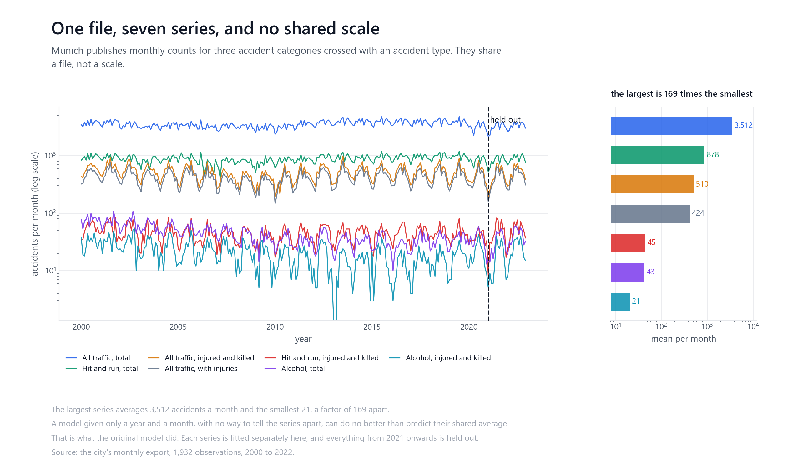
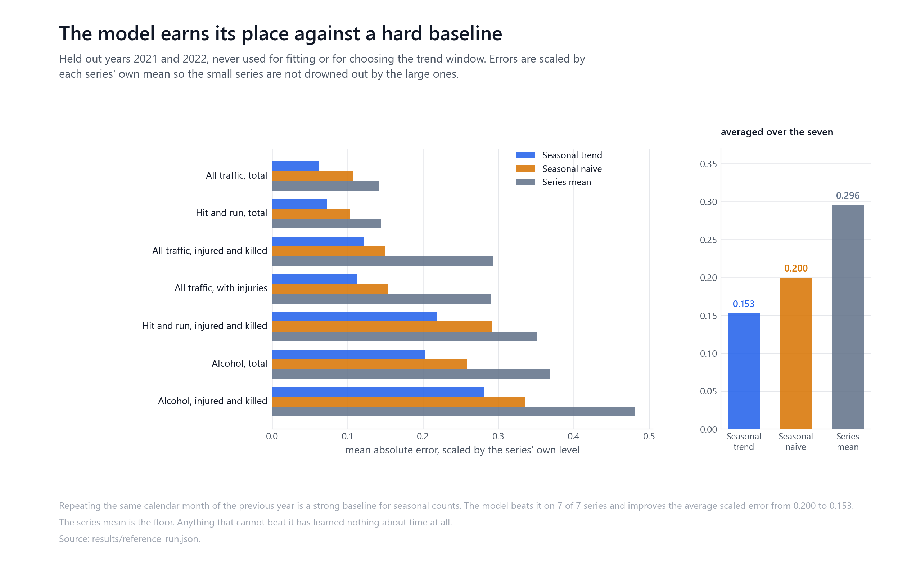
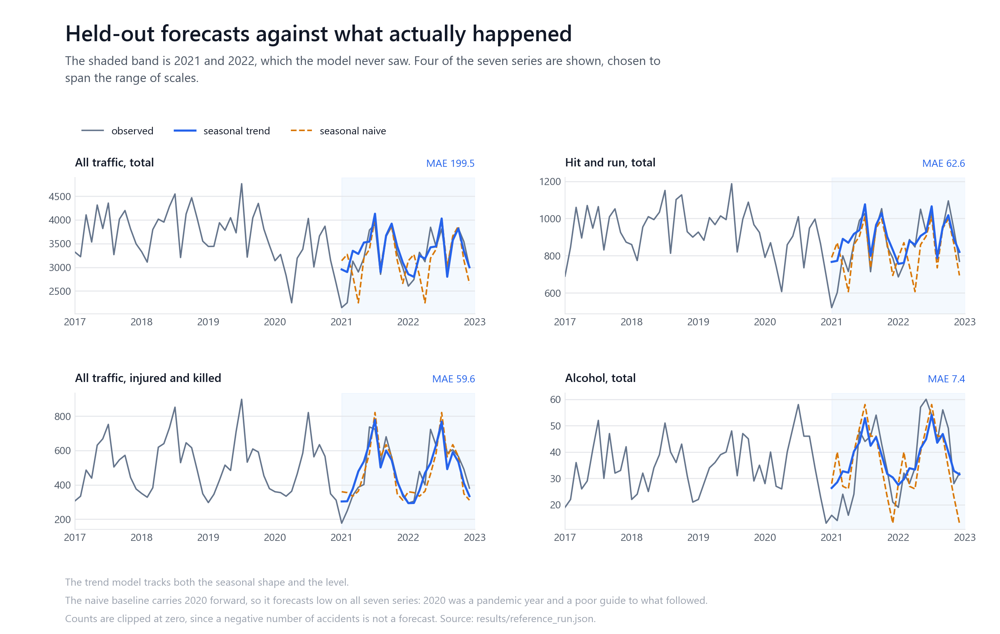

# Munich road accident forecasting

Monthly forecasts for Munich's published road accident counts, served behind a
small HTTP API. Built for the Digital Product School coding challenge, then
rebuilt after the original model turned out not to work.

## Why this exists in its current form

The first version of this project fitted one linear regression to every row of
the city's export at once. That file holds seven different monthly series, three
accident categories crossed with an accident type, and their averages range from
21 to 3,512 accidents per month, a factor of 169. Fitting a single line through all seven, with
only a year and a month as input, produced a model with an R² of 0.0009 and a
mean absolute error of 824 against a target averaging 780. The API it served
accepted no way to say which series you wanted, and described its output as a
number of deaths, which is not a quantity the dataset contains.

That model is reproduced exactly in `docs/provenance.md` before anything was
changed, so the criticism is measured rather than asserted. What follows is the
rebuild.



## The data

Munich publishes monthly road accident counts through its open data portal. The
snapshot used here is the May 2024 export, included in the repository as the
challenge input.

| | |
| --- | --- |
| Series | 7, being 3 categories crossed with an accident type |
| Observations | 1,932 monthly counts |
| Period | 2000 to 2022 |
| Categories | Alkoholunfälle, Fluchtunfälle, Verkehrsunfälle |
| Types | insgesamt, Verletzte und Getötete, mit Personenschäden |

Three details in the file matter and each is handled in `dps/data.py`. `MONAT`
holds YYYYMM rather than a month number. Rows with `MONAT` set to `Summe` are
annual subtotals and would swamp the monthly series. Rows exist for 2023 and 2024
with no values, because those months were not published, which is not the same
thing as zero accidents.

## The model

Each series is fitted separately, because they do not share a scale. Within a
series the model is a linear trend in time plus a monthly seasonal offset, fitted
on the most recent six years. Predictions are clipped at zero.

The six-year window is a choice, so it was made on 2019 and 2020 and the test
years were left alone. `docs/evaluation.md` records every window that was tried.

## Results



Held out: 2021 and 2022, 168 monthly observations, scored once. Errors are
averaged across the seven series after scaling each by its own level, so the
small series are not drowned out by the large ones.

| Method | Scaled MAE | MAPE |
| --- | --- | --- |
| Seasonal trend | **0.153** | **20.5%** |
| Seasonal naive | 0.200 | 25.4% |
| Series mean | 0.296 | 42.2% |

The seasonal naive baseline, which repeats the same calendar month of the
previous year, is the comparison that matters for seasonal counts. The model
beats it on all seven series.

One caveat belongs next to that result rather than at the bottom of the page. The
baseline carries 2020 forward, and 2020 was a pandemic year, so it forecasts low
on all seven series. Part of the margin is that timing rather than the model.



## Reproducing

Python 3.11.

```bash
pip install -r requirements.txt
python -m dps.pipeline
```

That reads the CSV, selects the trend window on the validation years, refits,
scores against both baselines, and writes `models/forecaster.joblib` and
`results/reference_run.json`. It runs in a few seconds.

Figures are regenerated from that run:

```bash
pip install -r requirements-dev.txt
python scripts/figures/generate_figures.py
```

## The API

```bash
uvicorn app:app --reload
```

| Endpoint | Purpose |
| --- | --- |
| `GET /` | Liveness, and whether the model artifact loaded |
| `GET /series` | The seven series that can be forecast, and the last year trained on |
| `POST /predict` | A forecast for one series, year and month |

```bash
curl -s -X POST localhost:8000/predict \
  -H 'Content-Type: application/json' \
  -d '{"category": "Alkoholunfälle", "kind": "insgesamt", "year": 2021, "month": 6}'
```

A request naming a series that does not exist returns 404 with the list of valid
ones, since a caller has no way to guess German category names. If the artifact
is missing the service reports that at `/` and returns 503 rather than pretending.

## Limitations

The test period is two years covering a pandemic and its rebound, which is an
unusual stretch to be judged on.

The model sees only its own history. There are no covariates for weather, traffic
volume, policy, road works or changes in reporting, so it cannot anticipate a
change in any of them.

This is a coding challenge exercise, not a public safety tool. Nothing here has
been validated for operational use, and the counts it forecasts are aggregates
for a whole city.

## Attribution

Data: Landeshauptstadt München open data portal, included as the challenge input
and not redistributed under any claim of ownership. Check the portal's current
terms before reuse.

The challenge framing is the Digital Product School's. The implementation and
evaluation are the author's own. `docs/provenance.md` separates the original
submission from the rebuild, and the original notebooks are preserved unmodified
in `notebooks/`.

## Licence

MIT for the code, see [LICENSE](LICENSE). The dataset is covered by its own terms.
